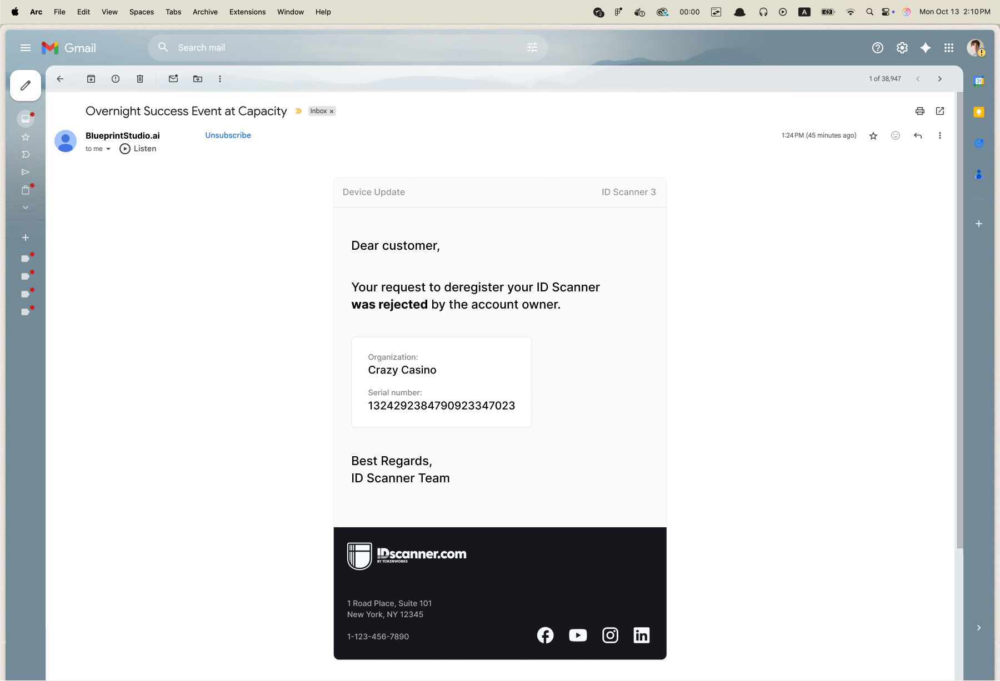

# react-email-sendgrid

Build on-brand emails with your design system in code, then hand them off to designers and managers who can edit copy and rearrange sections in SendGrid's visual editor.



## Quick Start

```bash
npm install
npm run build     # Renders emails to dist/
npm run watch     # Rebuild on changes
```

Upload the HTML from `dist/` to SendGrid as a design template.

## Usage

Compose emails from SendGrid-compatible primitives (`SendGridText`, `SendGridButton`, `SendGridImage`, etc.) and customize the `EmailHeader` and `Footer` components with your brand:

```tsx
import SendGridBaseEmail from "../sendgrid-components/SendGridBaseEmail";
import { H1, P } from "../sendgrid-components/SendGridText";
import SendGridButton from "../sendgrid-components/SendGridButton";
import EmailHeader from "../components/EmailHeader";
import Footer from "../components/Footer";

export default function InviteEmail() {
  return (
    <SendGridBaseEmail>
      <EmailHeader logoSrc="https://your-cdn.com/logo.png" />
      <H1>You're invited</H1>
      <P>Click below to accept your invitation:</P>
      <SendGridButton href="{{INVITE_LINK}}">Accept Invite</SendGridButton>
      <Footer companyName="Acme Inc." />
    </SendGridBaseEmail>
  );
}
```

Update colors and spacing in `src/styles.ts`. Use `{{VARIABLE}}` syntax for dynamic content that [SendGrid substitutes](https://docs.sendgrid.com/for-developers/sending-email/using-handlebars) at send time.

## Testing

```bash
npm run test:ethereal WelcomeEmail   # No credentials needed, prints preview URL
npm run test:gmail WelcomeEmail      # Requires .env.local (see .env.example)
```

## Known Issues

- Column components don't maintain proper formatting in vanilla HTML rendering outside of SendGrid
- Dark mode support is limited by SendGrid's drag-and-drop constraints. The `SendGridCodeBlock` workaround forces dark backgrounds but makes those sections non-editable in the visual editor.
- SendGrid-specific attributes (`role="module"`, `data-type`, etc.) are not fully covered by TypeScript's built-in HTML types

## License

MIT